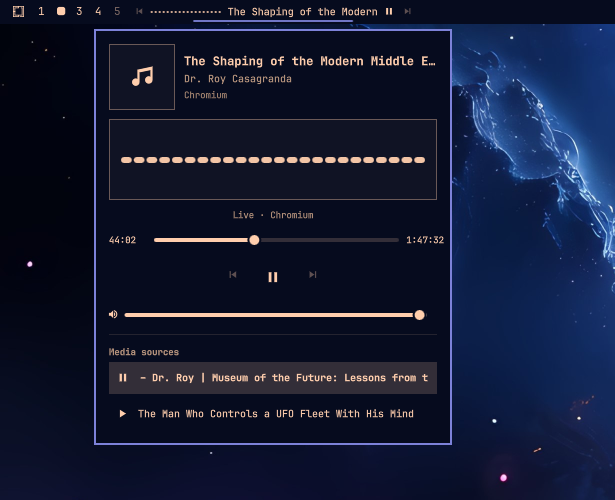

# WaveBar: Waveform Media Controller

WaveBar is a standalone Omarchy bar plugin that combines a live audio
waveform with focused MPRIS playback controls for browsers, Spotify, and other
desktop media players.



## Features

- Shows meaningful browser and desktop-player media exposed through MPRIS.
- Supports Spotify and other MPRIS-compatible players.
- Ignores games, notification sounds, and generic application audio.
- Visualizes only a confidently matched local PipeWire playback stream.
- Provides previous, play/pause, next, seek, volume, and source controls.
- Controls the matched local PipeWire stream volume for browsers whose MPRIS
  endpoint ignores volume writes.
- Selecting a media source immediately starts it and pauses the prior source.
- Keeps long titles inside the widget and source list with horizontal scrolling.
- Supports horizontal and vertical Omarchy bars.
- Can live in the left, center, or right section of the Omarchy bar.
- Exposes display options through Omarchy's native widget settings UI.

## How media filtering works

WaveBar uses Omarchy's built-in `omarchy.media` MPRIS service and requires
meaningful track metadata. Games and ordinary audio streams are not shown just
because they make sound.

For the waveform, the selected player is matched to a PipeWire playback
stream. A track-title or artist match wins. An app-only match is accepted only
when exactly one stream belongs to that app. If several browser streams are
indistinguishable, playback controls remain available but the waveform stays
quiet rather than visualizing an unrelated game or tab.

## Install

WaveBar relies on the `python` and `pipewire-audio` packages included with a
standard Omarchy installation. The plugin does not install or update system
packages.

```sh
omarchy plugin add https://github.com/ErikBurdett/omarchy-wavebar.git --enable
```

## Update

```sh
omarchy plugin update io.github.erikburdett.wavebar
```

## Usage

- Use the bar buttons for previous, play/pause, and next.
- Click the waveform or title to open the details panel.
- Scroll over the waveform or title for previous or next.
- In the panel, Space toggles playback, Left/Right seek five seconds, and P/N
  select previous/next.
- Click any entry under **Media sources** to select and immediately play it.

Browser media must expose MPRIS/Media Session metadata. Spotify and other
desktop players work through their normal MPRIS interface. A remote Spotify
Connect device can still be controlled, but it has no local PipeWire audio to
visualize.

## Choose the bar position

Use Omarchy's bar settings UI, or place WaveBar from the command line:

```sh
omarchy bar move io.github.erikburdett.wavebar --section left
omarchy bar move io.github.erikburdett.wavebar --section center
omarchy bar move io.github.erikburdett.wavebar --section right
```

You can also position it relative to another widget:

```sh
omarchy bar move io.github.erikburdett.wavebar --after omarchy.workspaces
omarchy bar move io.github.erikburdett.wavebar --before omarchy.tray
```

The manifest uses `left` only as the initial default. Omarchy preserves the
user's chosen placement in `~/.config/omarchy/shell.json`.

Use WaveBar's native widget settings in Omarchy to show or hide the playback
controls and title, hide the widget while paused, or adjust the waveform and
title widths. The equivalent inline configuration is:

```json
{
  "id": "io.github.erikburdett.wavebar",
  "showControls": true,
  "showTitle": true,
  "hideWhenPaused": false,
  "waveformWidth": 72,
  "maxTitleWidth": 150
}
```

`waveformWidth` is constrained to 40–240 pixels and `maxTitleWidth` to
60–320 pixels.

## Dependencies and security

- Omarchy 4 / Quattro shell
- Quickshell's MPRIS and PipeWire services
- `/usr/bin/pw-record` from the `pipewire-audio` package
- `/usr/bin/python3` and the Python 3 standard library from the `python` package

WaveBar opens no network connections and rejects MPRIS-provided artwork rather
than loading an untrusted URL or file. It uses only local MPRIS and PipeWire
services. Media collections, metadata fields, capture targets, waveform frames,
and user-configurable widths all have explicit limits.

The service invokes fixed `/usr/bin/python3` and `/usr/bin/pw-record` paths with
a cleared environment and no shell. Its helper validates system-executable
ownership, modes, and file capabilities; discards recorder diagnostics; and
uses a race-checked Linux parent-death signal plus dedicated process-group
supervisor and subreaper. Teardown always sends group-wide TERM then KILL and
normal teardown waits for every adopted descendant. A nonblocking signal wakeup
pipe prevents an interrupted PCM read from delaying that cleanup. If the helper
disappears unexpectedly, the parent-death-armed supervisor applies the same
group-wide termination. Unsafe-runtime and missing-dependency failures stop
automatic retries and surface an actionable panel message. Component destruction
explicitly stops the helper. WaveBar requests no elevated privileges, writes no
user configuration, and includes no installer. It runs inside the existing
`omarchy-shell`; it never starts another Quickshell process.

The complete runtime process chain is:

```text
omarchy-shell
└─ /usr/bin/python3 -I -S waveform.py
   └─ /usr/bin/python3 -I -S waveform.py --internal-mode supervise
      └─ /usr/bin/python3 -I -S waveform.py --internal-mode record
         └─ execve /usr/bin/pw-record
```

Every edge uses an argument array or `execve`; no Unix shell is involved. The
helper runs only while a playing MPRIS session has one safely matched local
PipeWire stream. It opens no network connections; `pw-record` uses the local
PipeWire session only. Audio is reduced to transient waveform levels, and no
media or metadata is written to disk. Omarchy may persist settings a user
deliberately changes through its normal widget settings UI; WaveBar itself does
not modify `shell.json` or any other user configuration.

## Validate

```sh
PLUGIN_DIR="$HOME/.config/omarchy/plugins/io.github.erikburdett.wavebar"
omarchy plugin validate "$PLUGIN_DIR"
/usr/lib/qt6/bin/qmllint -I /usr/share/omarchy/shell \
  "$PLUGIN_DIR/Service.qml" "$PLUGIN_DIR/BarWidget.qml" \
  "$PLUGIN_DIR/Panel.qml" "$PLUGIN_DIR/Waveform.qml" \
  "$PLUGIN_DIR/MarqueeText.qml"
node "$PLUGIN_DIR/tests/test_media_model.js"
/usr/bin/python3 "$PLUGIN_DIR/tests/test_manifest.py"
/usr/bin/python3 "$PLUGIN_DIR/tests/test_waveform.py"
QT_QPA_PLATFORM=offscreen QT_QPA_PLATFORMTHEME=generic \
  /usr/lib/qt6/bin/qmltestrunner -input "$PLUGIN_DIR/tests" \
  -import /usr/share/omarchy/shell
```

The repository also runs the manifest, Python, and JavaScript checks in GitHub
Actions. See [tests/README.md](./tests/README.md) for the live process-lifecycle
release check.

Release changes are recorded in [CHANGELOG.md](./CHANGELOG.md).

Inspect the live service:

```sh
omarchy-shell io.github.erikburdett.wavebar status
```

## Remove

```sh
omarchy plugin remove io.github.erikburdett.wavebar
```

## License

[MIT](./LICENSE) © 2026 Erik Burdett
